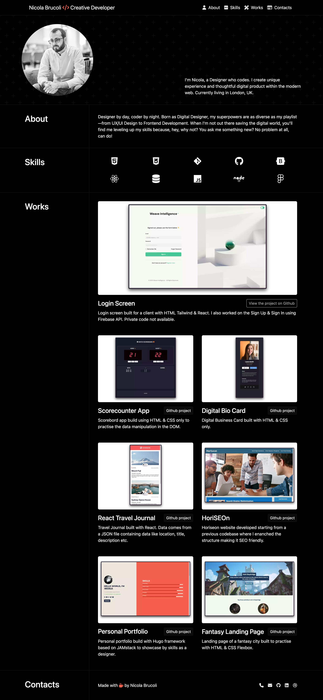

# Bootstrap-Porfolio
Repository of my personal frontend developer portfolio website made with Bootstrap.

Live Website hosted on Github Pages: https://sonictrain.github.io/Bootstrap-Porfolio/

## Table of Contents 
- [Preview](#preview)
- [Description](#description)
- [Wireframe](#wireframe)
- [Usage](#usage)
- [Credits](#credits)
- [License](#license)

## Preview


## Description
Welcome to my portfolio repository! This GitHub project host the code for my professional portfolio website, built using Bootstrap 5.3 trying to minimise the use of CSS and media queries.
The site showcases my projects, and experiences through clean and semantic code as well as my skills. Explore the sections on projects, skills, and a brief about me.
Your feedback is valuable as I continuously refine and expand my online presence. Thanks for visiting and feel free to take a look to the other project built with HTML & CSS [Live Website](https://sonictrain.github.io/nicola-brucoli-portfolio/) [Repository](https://github.com/sonictrain/nicola-brucoli-portfolio) 

## Wireframe
The wireframe of the project is available on Figma and it is currently a WIP. Link to the [Figma](https://www.figma.com/file/gNEyuhbyu4AU5vJ0tF7DUv/Personal-Portfolio?type=design&node-id=0%3A1&mode=design&t=hVB7J0tNl7wv2vJS-1).

## Usage
Simply clone the repo using the following command:
```
git clone <repository-address>
```

cd inside the the repository on your local machine:
```
cd nicola-brucoli-portfolio
```

and finally launch the `index.html` file with a browser of your choice.
Feel free to visit the website from [this link](https://github.com/sonictrain/Bootstrap-Porfolio).

## License
Copyright (c) Nicola Brucoli. All rights reserved.
Licensed under the [MIT](./LICENSE) license.